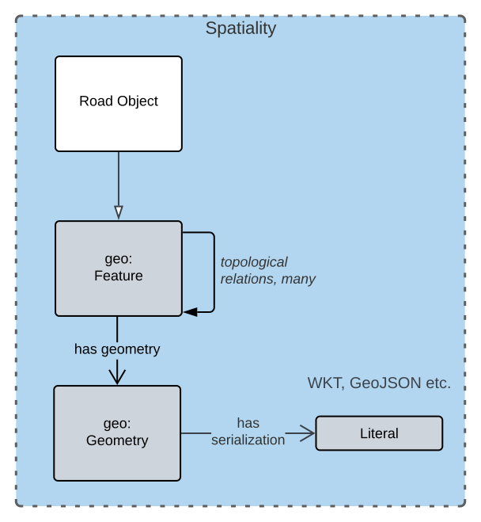

== Introduction

This model facilitates applying Road Name objects, with potentially many subcomponents, to the geospatial representation of roads - Road Objects. This style of feature name / geospatial feature modelling is informed inherited from the https://linked.data.gov.au/def/cn[Compound Naming Model] that this model extends.

NOTE: This model does not attempt to assist with detail geospatial aspects of road modelling: it only provides an association between naming components and geospatial representations of the road established using other models and with categorisation of road objects. This model also does not link road objects to other, related, objects, such as Localities. Such linking should be represented with Feature / Feature topological relations, such as those within GeoSPARQL <<GEO>>.

Data made according to this model, when stored in one of the <<RDF>> serialization formats such as <<TTL>>, is directly validatable according to this model through use of validators that are supplied, see Section <<Validation>>.

=== Sources of Requirements

This model was initially built to allow Queensland Government to manage roads naming information in a manner similar to how they manage Address & Geographic Name information: as a collection of Feature Names for Features which have Geometries. This introduces requirements to both facilitate complex naming and align with Address etc. modelling.

To ensure that this model implements that Feature Name / Feature / Geometry pattern, it is a profile of the https://linked.data.gov.au/def/cn[Compound Naming Model] which captures the pattern in generic form and is also profiled by Queensland Government's Address & Geographic Names Models. Figure <<fig-roads-spatial>> overviews this. This introduces the requirement for all Roads Model information to conform to the Compound Names Model - the necessary requirement for profiling.

By profiling that model, this model also remains interoperable with detailed spatial object modelling, for example of the sort implemented in the https://linked.data.gov.au/cad[Cadastre Model].

Detailed requirements for this model all stem from these top-level requirements. The individual requirements are listed in the <<Requirements>> section.

=== Major Modelling Principles

Major modelling principles present in this model are:

. Feature / Feature Naming differentiation
. Feature / Geometry differentiation
. Profile Views

These principles are explained in the following sub-sections and the first two reference the following figure.

[[fig-roads-spatial]]
.Roads Object spatial modelling

==== Feature / Feature Naming differentiation

This model details the elements of a road name but not details of the spatial objects that addresses are assigned to - the geospatial road objects. The general conceptual split of name/spatial object follows the Address/AddressableObject split in ISO19160-1 <<ISO19160-1>>. Addresses there are seen as a form of complex, multi-part, label - Feature Name - for a spatial Feature and Road Names here are considered a simple case of that.

This allows for the representation, and ultimately the management, of names - text, numbers, identifiers, references - separately to the management of spatial objects and their properties, such as the physical presentation of a Road.

This Feature / Feature Naming separation applies to Geographic Names, Roads and Administrative Areas as well as Addresses and this expression of Feature / Feature Naming separation for addressing is a formal profile of the more general _Compound Naming Model_ <<CNM>>. There are other profiles for those other domains. The CNM, this model and the other CNM profiles are all pat of Queensland Spatial Information's https://spatial-information-qld.github.io/supermodel/supermodel.html[_Supermodel_] which is an enterprise data model for multi-model data integration.

==== Feature / Geometry differentiation

(Geo)spatial objects referenced by this model's naming objects (Road Names) are not geometries but conceptual spatial objects that have as an expression of their spatial projection one or more geometries. See Figure <<fig-roads-spatial>>. This conceptual object - Feature - and spatial expression - Geometry - split is based on fundamental spatial modelling in standards such as <<ISO19101-1>> and their expression in the Semantic Web spatial standard <<GEO>>.

This Feature / Geometry distinction allows individual spatial objects to have multiple Geometries: different resolutions, in different coordinate systems and even sets of Geometries that have different roles or that show variation over time. This would allow Road Objects to have spatiallity represented with road centrelines, area polygons from cadastre etc., all at the same time, by linking those different spatial representations - the Geometries - to the single conceptual entity - the Feature.

=== Profile Views

Road Names have multiple roles: they indicate places with names (or Features with Names), they are things to be managed by data holders, and they have statuses, lifecycles and so on. Sometimes we are only interested in one of these aspects of a Road Name or one _profile_ and not the total information held. We may also be interested only in a reduced set of properties of a Road Name even when others within that role are present, e.g. the current status, not all the statues an Address has ever had. Finally, different implementers of this model may want to implement different jurisdictional profiles of the model that, for example, mandate certain information be stored for Road Names, that may be meaningless outside that jurisdiction.

All of these sorts of _profiles_ of Road Names are handled in a similar way in this model: they are declared Profiles of the model that may implement additional rules and/or requirements on data, however they must always conform to the main Roads Model itself.

Profile modelling is given in <<PROF>> and requesting profiles from data conforming to a model is given in <<CONNEGP>>.

=== Model resources

This document is this model's "Specification" which is its authoritative, human-readable, definition document. This model also contains other resources with other roles:

[width="75%", cols="2,1,4"]
|===
| Resource | Role | Notes

| https://spatial-information-qld.github.io/address-model/model.ttl[Ontology] | _Schema_ | The technical, machine-readable, version of this model
| <<Supporting Vocabularies>> | _Vocabulary_ | The codelist vocabularies developed for this model and links to others defined elsewhere but used by this model
| <<Requirements>> Section | _Guidance_ | The Requirements addressed by this model
| <<Validation>> Section & https://github.com/Spatial-Information-QLD/roads-model/blob/main/validator.ttl[SHACL Validator] | _Validation_ | The machine-readable validator file used to validate data claiming conformance to this model
| <<Templating>> Section | _Guidance_ | The template logic used for Basic and Short Form templates
| <<Examples>> Section
&
https://github.com/Spatial-Information-QLD/roads-model/tree/main/extended-examples[Extended example data files] | _Example_ | Examples of data conforming, and some not conforming, to this model
| https://github.com/Spatial-Information-QLD/roads-model[Code Repository] | _Code Repository_ | The online, version control, repository containing all the resources of this model
|===
