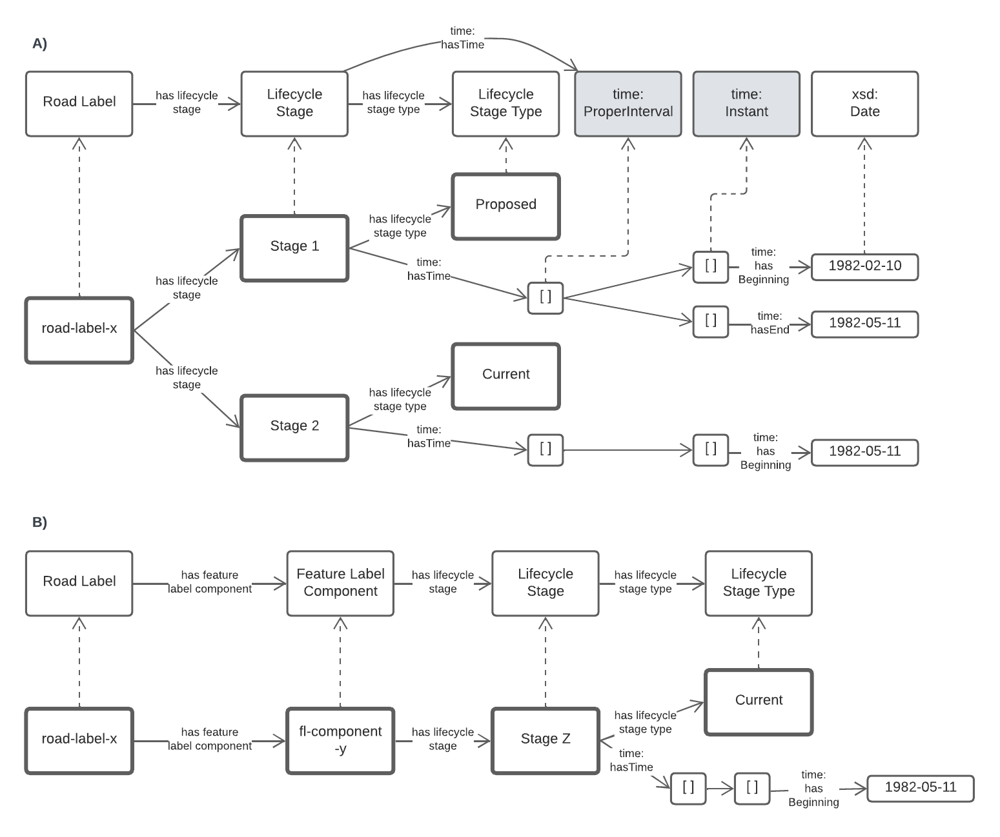

== Model

This model is composed of Web Ontology Language (OWL) <<OWL>> Classes and Properties. While some of the properties are restricted in their use to various classes, the Classes and Properties are actually defined individually and both are "first class model citizens", with global identity, that can be used in isolation and together. This is in contrast to Unified Modelling Language (UML) _Class Diagrams_ which treat Properties as sub-parts of particular classes.

This model defines some Classes and Properties and also requires certain existing Cs & Ps for reuse. All Cs & Ps in this model, both defined and reused, are listed here with an indication of where the element is defined given in the _Is Defined By_ field.

[[Classes]]
=== Classes

* <<RoadLabel>>
* <<RoadObject, Road Object>>
* <<FeatureLabelComponent, Feature Label Component>>
* <<FeatureLabelComponentType, Feature Label Component Type>>
* <<LifecycleStage, Lifecycle Stage>>
* <<FeatureLabelLifecycleStageType, Lifecycle Stage Type>>

[[RoadLabel]]
==== Road Label

[cols="2,6"]
|===
| Property | Value

| IRI | `roads:RoadLabel`
| Preferred Label | Road Label
| Definition | The Road Label class represents structured information that allows unambiguous determination of a Road Object for the purposes of identification and location
| Is Defined By | https://linked.data.gov.au/def/roads[Road Model]
| Sub-class Of | https://linked.data.gov.au/def/fl/FeatureLabel[`fl:FeatureLabel`]
| Provenance | Specialised from <<FL>>'s Feature Label class
| Expected Properties | <<isLabelFor>>, <<hasLabelComponent>>, <<hasLifecycleStage>>
| Example 
a| [source,turtle]
----
# Yundah Street South
ex:road-label-1
  a roads:RoadLabel ;
  fl:isLabelFor <some-external-object> ;
  roads:hasFeatureLabelComponent
    [
      roads:hasValue "Yundah" ;
      fl:hasComponentType rct:RoadName ;
    ] ,
    [
      roads:hasValue st:Street ;
      fl:hasComponentType rct:RoadType ;
    ] ,
    [
      roads:hasValueText "South" ;
      fl:hasComponentType rct:RoadSuffix ;
    ] ;
.
----
|===

[[RoadObject]]
==== Road Object

[cols="2,6"]
|===
| Property | Value

| IRI | `roads:[Road Model]`
| Preferred Label | Road Object
| Definition | A geospatial object that is unambiguously identified by a Road Label.

Examples of types of RoadObjects are a sequences of cadastral parcels of type _road_.
| Is Defined By | https://linked.data.gov.au/def/roads[Road Model]
| Sub-class Of | https://opengeospatial.github.io/ogc-geosparql/geosparql11/spec.html#_class_geofeature[`geo:Feature`]
| Provenance | Specialised from <<GEO>>'s Feature class, as used in <<FL>>
| Scope note | Judgement as to what makes for a permissible RoadObject rests with the implementer. This model's technical requirements are only that the object is a legal `geo:Feature` object, thus implementers may make Road Objects of almost anything.
| Expected Properties | <<hasAddress>>, http://www.opengis.net/ont/geosparql#[`geo:hasGeometry`]
| Example 
a| [source,turtle]
----
# ex:parcel-x is inferred to be a Road Object
# due to the property roads:hasFeatureLabel indicated for it
# that in tern indicates a Road Label instance

ex:parcel-aggregate-x fl:hasFeatureLabel ex:road-label-1 .

# this object is declared to be a Road Label
ex:road-label-1
  a roads:RoadLabel ;
  ...
.
----
|===

[[FeatureLabelComponent]]
==== Feature Label Component

[cols="2,6"]
|===
| Property | Value

| IRI | `roads:FeatureLabelComponent`
| Preferred Label | Feature Label Component
| Definition | A component that is a constituent part of a Feature Label
| Is Defined By | https://linked.data.gov.au/def/fl[Feature Labelling Model]
| Sub-class Of | http://www.w3.org/2000/01/rdf-schema#Resource[`rdfs:Resource`]
| Provenance | Derived by the Feature Labelling Model, derived in concept from <<ISO19160-1>>'s `AddressComponent` class
| Scope note | Feature Label Components can be literals - numbers, words etc. - or complex objects - Localities, water feature etc. If the Feature Label Component is a complex object, a textual representation of it must be provided when a textual rendering of all of an Feature Labels' components are required, for example for letter printing.

Complex objects are preferred for use over literals when the object referred to has independent identity.

Ordering of Feature Label Components, for example for letter printing, is not fixed within this model but should be implemented with a positioning preference system utilising the Feature Label Component's `fl:hasComponentType` values which should come from a controlled vocabulary of Feature Label Component Type values. This may be a template.
| Expected Properties | <<hasValue>>, <<hasValueText>>, <<hasComponentType>>
| Example 
a| [source,turtle]
----
# here ex:road-1 indicated three Feature Label Components
# that may be printed as 'Yundah Street South'
# or perhaps in short form, using another template:
# 'Yundah St Sth'

ex:road-1
  a roads:RoadLabel ;
  fl:isLabelFor <some-external-object> ;
  roads:hasFeatureLabelComponent
    [
      roads:hasValue "Yundah" ;
      fl:hasComponentType rct:RoadName ;
    ] ,
    [
      roads:hasValue st:Street ;
      fl:hasComponentType rct:RoadType ;
    ] ,
    [
      roads:hasValueText "South" ;
      fl:hasComponentType rct:RoadSuffix ;
    ] ;
.
----
|===

[[FeatureLabelComponentType]]
==== Feature Label Component Type

[cols="2,6"]
|===
| Property | Value

| IRI | `fl:FeatureLabelComponentType`
| Preferred Label | Feature Label Component Type
| Definition | The kind of Feature Label Component
| Is Defined By | https://linked.data.gov.au/def/fl[Feature Labelling Model]
| Sub-class Of | http://www.w3.org/2004/02/skos/core#Concept[`skos:Concept`]
| Provenance | Derived from <<ISO19160-1>>'s `addressComponentType` codelist
| Scope note | A Feature Label Component's type should be indicated with values from a controlled vocabulary - a code list. 

A SKOS vocabulary of Road Model component types is supplied with this model, see <<Supporting Vocabularies>>.
| Expected Properties | Standard properties for a SKOS Concept
| Example 
a| [source,turtle]
----
# three Feature Label Component Types are indicated here
# by the fl:hasComponentType property
ex:road-1
  a roads:RoadLabel ;
  fl:isLabelFor <some-external-object> ;
  roads:hasFeatureLabelComponent
    [
      roads:hasValue "Yundah" ;
      fl:hasComponentType rct:RoadName ;
    ] ,
    [
      roads:hasValue st:Street ;
      fl:hasComponentType rct:RoadType ;
    ] ,
    [
      roads:hasValueText "South" ;
      fl:hasComponentType rct:RoadSuffix ;
    ] ;
.
----
|===

[[LifecycleStage]]
==== Lifecycle Stage

[[fig-lifecycle]]
.A) An example Road Label, `road-label-x`, with Lifecycle Stages and B) An example Feature Label Component part of a Road Label with a Lifecycle Stage indicated

[cols="2,6"]
|===
| Property | Value

| IRI | `roads:AddressLifecycleStage`
| Preferred Label | Address Lifecycle Stage
| Definition | Represents the different lifecycle stages of an Address
| Is Defined By | https://linked.data.gov.au/def/roads[Road Model]
| Provenance | Derived from <<ISO19160-1>>'s `AddressLifecycle` class
| Scope note | An Address Lifecycle Stage's type should be indicated with values from a controlled vocabulary - a code list. 

A SKOS vocabulary of Address Lifecycle Stages is supplied with this model.
| Expected Properties | Standard properties for a SKOS Concept
| Example 
a| [source,turtle]
----
# An Address with two Lifecycle Stages indicated:
# one current and one past
ex:road-label-x
  a roads:RoadLabel ;
  roads:hasLifeCycleStage [
    # this Stage has ceased
    time:hasTime [
      time:hasBeginning [ time:inXSDDate "1982-02-10"^^xsd:date ] ;
      time:hasEnd [ time:inXSDDate "1982-05-11"^^xsd:date ] ;
    ] ;
    dcterms:type ls:proposed ;
  ] ,
  [
    # this Stage is still in effect - no hasEnd given
    time:hasTime [
      time:hasBeginning [ time:inXSDDate "1982-05-11"^^xsd:date ] ;
    ] ;
    dcterms:type ls:current ;
  ] ,  
.

# The Address Lifecycle Stage 'proposed'
# from the Address Lifecycle Stage Types vocabulary
# indicating only some properties
ls:proposed
    a skos:Concept ;
    ...
    skos:prefLabel "Proposed" ;
.
----
|===

[[FeatureLabelLifecycleStageType]]
==== Feature Label Lifecycle Stage Type

[cols="2,6"]
|===
| Property | Value

| IRI | `roads:FeatureLabelLifecycleStageType`
| Preferred Label | Address Lifecycle Stage Type
| Definition | Code that specifies the kind of Address Lifecycle Stage
| Is Defined By | https://linked.data.gov.au/def/fl[Feature Labelling Model]
| Sub-class Of | http://www.w3.org/2004/02/skos/core#Concept[`skos:Concept`]
| Provenance | Derived from <<ISO19160-1>>'s `AddressLifecycle` class' codelist of types
| Scope note | A Feature Label Lifecycle Stage's type should be indicated with values from a controlled vocabulary - a code list.

A SKOS vocabulary of Lifecycle Stage Types is supplied with the Feature Labelling Model <<FL>>.
| Expected Properties | Standard properties for a SKOS Concept
| Example 
a| [source,turtle]
----
# A Road Label with a Lifecycle Stages indicated
# which then indicates its type
ex:addr-1
  a roads:RoadLabel ;
  roads:hasLifeCycleStage [
    ...
    dcterms:type ls:proposed ;
  ] ;
  ...
.
----
|===

[[Properties]]
=== Properties

* <<isAddressFor, is address for>>
* <<hasAddress, has address>>
* <<hasAddressComponent, has address component>>
* <<hasAddressRole, has address role>>
* <<hasGeocode, has geocode>>
* <<hasLifecycleStage, has lifecycle stage >>
* <<hasValue, has value>>
* <<hasValueText, has value text>>

[[isAddressFor]]
==== is address for

[cols="2,6"]
|===
| Property | Value

| IRI | `roads:isAddressFor`
| Preferred Label | is address for
| Definition | Indicates an Addressable Object that an Address is allocated to
| Is Defined By | https://linked.data.gov.au/def/roads[Road Model]
| Sub-property Of | http://www.w3.org/2000/01/rdf-schema#label[`rdfs:label`]
| Inverse Of | <<hasAddress>>
| Provenance | Derived from <<ISO19160-1>>'s object relations
| Domain | <<Address, Address>>
| Range | <<RoadObject, Addressable Object>>
| Example 
a| [source,turtle]
----
# the Address ex:addr-1 is allocated to
# some-addressable-object
ex:addr-1
  a roads:Address ;
  roads:isAddressFor <some-addressable-object> ;
.
----
|===

[[hasAddress]]
==== has address

[cols="2,6"]
|===
| Property | Value

| IRI | `roads:hasAddress`
| Preferred Label | has address
| Definition | Indicates an Address has been allocated for an Addressable Object
| Is Defined By | https://linked.data.gov.au/def/roads[Road Model]
| Inverse Of | <<isAddressFor>>
| Provenance | Derived from <<ISO19160-1>>'s object relations
| Domain | <<RoadObject, Addressable Object>>
| Range | <<Address, Address>>
| Example 
a| [source,turtle]
----
# the roads:RoadObject, some-addressable-object,
# indicates an address with roads:hasAddress 
<some-addressable-object>
  a roads:RoadObject ;
  roads:hasAddress ex:addr-1 ;
.

ex:addr-1
  a roads:Address ;
.
----
|===

[[hasAddressComponent]]
==== has address component

[cols="2,6"]
|===
| Property | Value

| IRI | `roads:hasAddressComponent`
| Preferred Label | has address component
| Definition | Indicates an Address Component of an Address
| Is Defined By | https://linked.data.gov.au/def/roads[Road Model]
| Provenance | Derived from <<ISO19160-1>>'s object relations
| Domain | <<Address, Address>>
| Range | <<AddressComponent, Address Component>>
| Example 
a| [source,turtle]
----
# an Address has an Address Component, a street number, indicated
ex:addr-1
  a roads:Address ;
  roads:hasAddressComponent [
      roads:hasValue 20 ;
      fl:hasComponentType addrct:streetNumber ;
    ] ,
...
----
|===

[[hasAddressComponentType]]
==== has address component type

[cols="2,6"]
|===
| Property | Value

| IRI | `roads:hasAddressComponentType`
| Preferred Label | has address component type
| Definition | Indicates an Addresses Component's type
| Is Defined By | https://linked.data.gov.au/def/roads[Road Model]
| Provenance | Derived from <<ISO19160-1>>'s object relations
| Domain | <<AddressComponent, Address Component>>
| Range | <<AddressComponentType, Address Component Type>>
| Example 
a| [source,turtle]
----
# an Address has an Address Component with its type,
# street number, indicated
ex:addr-1
  a roads:Address ;
  roads:hasAddressComponent [
      roads:hasValue 20 ;
      fl:hasComponentType addrct:streetNumber ;
    ] ,
...
----
|===

[[hasAddressRole]]
==== has address role

[cols="2,6"]
|===
| Property | Value

| IRI | `roads:hasAddressRole`
| Preferred Label | has address component type
| Definition | Indicates an Address Role for an Address
| Is Defined By | https://linked.data.gov.au/def/roads[Road Model]
| Provenance | Derived from <<ISO19160-1>>'s AddressPosition class and properties
| Domain | <<Address>>
| Range | <<AddressRole, Address Role>>
| Example 
a| [source,turtle]
----
# An Address with two roles
ex:addr-1
  a roads:Address ;
  roads:hasAddressRole 
    ex:emergencyAccess ,
    buildingAccessPoint ;
    ... 
----
|===

[[hasGeocode]]
==== has geocode

[cols="2,6"]
|===
| Property | Value

| IRI | `roads:hasGeocode`
| Preferred Label | has geocode
| Definition | Indicates a refined, that is a very accurate or specific, geometry, usually a point, for an Address qualified by the Geocode Type - how it was generated.
| Is Defined By | https://linked.data.gov.au/def/roads[Road Model]
| Provenance | Derived from the G-NAF's expression of Address position
| Scope Note | This property, along with hasRole, allows multiple Addresses with different locations to be allocated to Addressable Objects and for those addresses to be used for different purposes. The location indicated by this property should be within/on/next to the location of the Addressable Object this Address is for, within some acceptable tolerance.
| Domain | <<Address>>
| Range | <<Geocode>>
| Example 
a| [source,turtle]
----
# An Address with a Geocode and a role
ex:addr-1
  a roads:Address ;
    roads:hasGeocode [
      dcterms:type geocodeType:DF ;  # Driveway Frontage
      geo:hasGeometry "POINT (152.01 -35.03)"^^geo:wktLiteral ; 
    ] ;
    addre:hasRole roads:buildingAccessPoint ;
    ...
----
|===

[[hasLifecycleStage]]
==== has lifecycle stage

[cols="2,6"]
|===
| Property | Value

| IRI | `roads:hasLifecycleStage`
| Preferred Label | has lifecycle stage
| Definition | Indicates an Addresses' Lifecycle Stage
| Is Defined By | https://linked.data.gov.au/def/roads[Road Model]
| Provenance | Derived from <<ISO19160-1>>'s object relations
| Domain | <<Address, Address>>
| Range | <<AddressLifecycleStage, Address Lifecycle Stage>>
| Example 
a| [source,turtle]
----
# An Address with two Lifecycle Stages indicated:
# one current and one past
ex:addr-1
  a roads:Address ;
  roads:hasLifeCycleStage [
    # this Stage has ceased
    time:hasTime [
      time:hasBeginning [ time:inXSDDate "1982-02-10"^^xsd:date ] ;
      time:hasEnd [ time:inXSDDate "1982-05-11"^^xsd:date ] ;
    ] ;
    dcterms:type ls:proposed ;
  ] ,
  [
    # this Stage is still in effect - no hasEnd given
    time:hasTime [
      time:hasBeginning [ time:inXSDDate "1982-05-11"^^xsd:date ] ;
    ] ;
    dcterms:type ls:current ;
  ] ,  
.
----
|===

[[hasValue]]
==== has value

[cols="2,6"]
|===
| Property | Value

| IRI | `roads:hasValue`
| Preferred Label | has value
| Definition | Indicates the value of an Address Component
| Is Defined By | https://linked.data.gov.au/def/roads[Road Model]
| Provenance | Derived from <<ISO19160-1>>'s AddressComponent object's properties
| Domain | <<AddressComponent, Address Component>>
| Range | http://www.w3.org/2000/01/rdf-schema#Resource[`rdfs:Resource`] (IRI or literal)
| Example
a| [source,turtle]
----
ex:addr-1
  a roads:Address ;
  roads:hasAddressComponent
    [
      # "StreetNumber" type
      roads:hasValue 20 ;
      fl:hasComponentType addrct:streetNumber ;
    ] ,
    [
      # "StreetName" type
      roads:hasValue "Oxford" ;
      fl:hasComponentType addrct:thoroughfareName ;
    ] ,
    [
      # "Locality" type
      roads:hasValue <http://example.com/lga/1234> ;
      # textual value of complex object
      roads:hasValueText "Shorncliffe" ;
      fl:hasComponentType addrct:locality ;
    ] ,
    ...
----
|===

[[hasValueText]]
==== has value text

[cols="2,6"]
|===
| Property | Value

| IRI | `roads:hasValueText`
| Preferred Label | has value
| Definition | Indicates the textual rendering of an Address Component
| Scope note | This property is to be used to represent the textual value of Address Components that are literals and also complex objects. For a literal, the same value will be present for hasValue and hasValueText, e.g. a street number of 20 or a property name of "Bonnie Doon", however for a complex object, e.g. the locality `<http://example.com/lga/1234>`, a textual representation of it must be selected. Likely a simple name for the object will do, i.e. a Locality name or a Street Locality name.
| Is Defined By | https://linked.data.gov.au/def/roads[Road Model]
| Provenance | Derived from <<ISO19160-1>>'s AddressComponent object's properties
| Domain | <<AddressComponent, Address Component>>
| Range | http://www.w3.org/2001/XMLSchema#string[`xsd:string`]
| Example
a| [source,turtle]
----
ex:addr-1
  a roads:Address ;
  roads:hasAddressComponent
    [
      # "StreetNumber" type
      roads:hasValue 20 ;
      roads:hasValueText "20" ;
      fl:hasComponentType addrct:streetNumber ;
    ] ,
    [
      # "StreetName" type
      roads:hasValue "Oxford" ;
      roads:hasValueText "Oxford" ;
      fl:hasComponentType addrct:thoroughfareName ;
    ] ,
    [
      # "Locality" type
      roads:hasValue <http://example.com/lga/1234> ;
      # textual value of complex object
      roads:hasValueText "Shorncliffe" ;
      fl:hasComponentType addrct:locality ;
    ] ,
    ...
----
|===
