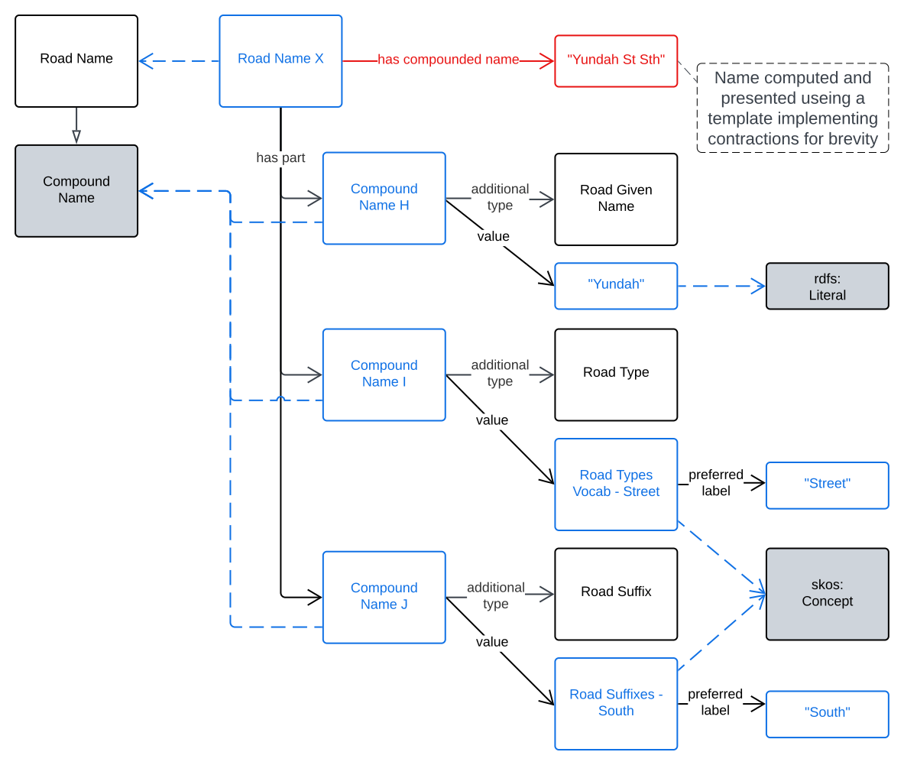
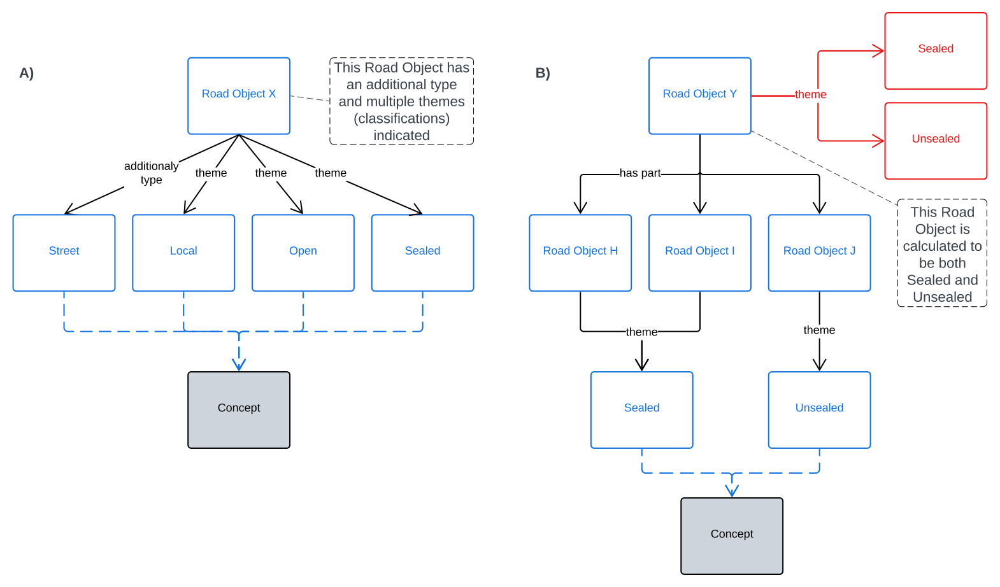
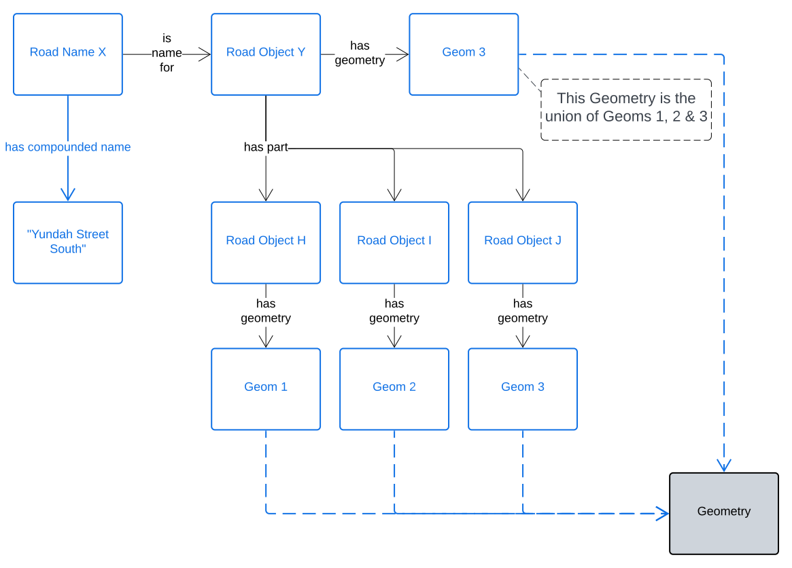

== Examples

This model contains examples per Class and Property in the <<Model>> section as well as for each template within in the <<Templating>> section. Additionally, the following drawn examples are provided to illustrate modelling intentions.

=== Modelling Scenarios

[[fig-eg-naming]]
.Roads Naming example

[[fig-eg-classification]]
.Roads Classification examples

[[fig-eg-parts]]
.Roads Parts examples

=== Code

The following code is the aggregate of the per-Class and Property examples.

[source,turtle]
----
# a geospatial Road Object instance
ex:road-x
    a ex:Road ;
.

# Yundah Street South with Feature Label and Lifecycle Stages indicated
ex:road-label-1
  a roads:RoadLabel ;
  fl:isLabelFor ex:road-x ;
  fl:hasFeatureLabelComponent
    [
      fl:hasValue "Yundah" ;
      fl:hasComponentType rct:RoadName ;
    ] ,
    [
      fl:hasValue st:Street ;
      fl:hasComponentType rct:RoadType ;
    ] ,
    [
      fl:hasValueText "South" ;
      fl:hasComponentType rct:RoadSuffix ;
    ] ;
  roads:hasLifeCycleStage [
    # this Stage has ceased
    time:hasTime [
      time:hasBeginning [ time:inXSDDate "1982-02-10"^^xsd:date ] ;
      time:hasEnd [ time:inXSDDate "1982-05-11"^^xsd:date ] ;
    ] ;
    dcterms:type ls:proposed ;
  ] ,
  [
    # this Stage is still in effect - no hasEnd given
    time:hasTime [
      time:hasBeginning [ time:inXSDDate "1982-05-11"^^xsd:date ] ;
    ] ;
    dcterms:type ls:current ;
  ] ;
.
----

The example above prints out as "Yundah Street South" using the _Basic Template_ provided in the <<Templating>> section and "Yundah St Sth" using that section's _Short Form Template_.